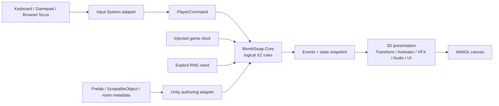

# 기술 아키텍처 개요

- 상태: `Accepted`
- 대상: Unity 6000 계열, URP, 3D WebGL
- 기술 네임스페이스/어셈블리 접두사: `BombSwap`

## 목적

프로토타입의 핵심 규칙을 빠르게 바꾸면서도 폭발 판정, 쿨타임, 절차 생성이 Unity 프레임·물리 순서와 브라우저 환경에 흔들리지 않게 한다. 사람은 시스템 책임과 데이터 흐름을 한눈에 파악하고, AI는 다른 세션에서도 같은 경계를 재구성하지 않고 이어서 작업할 수 있어야 한다.

## 핵심 구조

## 공간 모델

- 규칙 공간은 정수 `(x, z)` 셀이다.
- Y는 바닥 높이, 점프하지 않는 시각 연출, VFX 레이어에만 사용한다.
- 벽, 파괴 가능 벽, 폭탄, 폭발 예정 셀, 전투 점유는 논리 격자에 기록한다.
- Transform과 Collider는 표시와 접촉 후보를 제공할 수 있지만 최종 폭발·차단 판정의 권위 원본이 아니다.
- 연속 이동을 사용할 경우 월드 위치를 격자 좌표로 변환하는 책임은 Unity 어댑터가 가진다. 정확한 이동 감각은 프로토타입 플레이테스트 전까지 `Proposed`다.

## 계층 책임

| 계층 | 주요 책임 | 포함하지 않는 것 |
|---|---|---|
| Core | 격자 값, 폭탄 설치 규칙, 폭발 전파, 연쇄 스케줄, 피해 규칙, 쿨타임, 적 상태 전이, 던전 그래프 | MonoBehaviour, Transform, Physics, Input System, VFX |
| Runtime | Unity 생명주기, bootstrap, Input→Command, 월드↔격자 변환, Core 실행, 씬 상태 연결 | 게임 규칙의 중복 구현 |
| Presentation | 메시, 애니메이션, 카메라, UI, 오디오, Feel/VFX 어댑터 | 권위 게임 상태 |
| Authoring/Content | ScriptableObject 정의, 방 메타데이터, 프리팹 바인딩과 검증 대상 | 런타임 전역 mutable 상태 |
| Editor | 콘텐츠 검증기, 빌드 자동화, 안전한 마이그레이션 | 플레이어 빌드 런타임 코드 |
| Tests | 규칙 계약, Unity 통합, 콘텐츠와 플랫폼 검증 | 실제 재미의 자동 판정 |

## 주요 런타임 소유자

아래 이름은 현재 구현 타입과 후속 책임 경계를 함께 설명한다.

- `GridState`: 셀 종류와 점유의 권위 상태.
- `ManualGameClock`: Unity Runtime이 일시정지 정책과 시간 진행을 명시적으로 통제해 Core에 주입.
- `BombPlacementRules`: 설치 가능 여부와 설치 직후 통과 상태.
- `ExplosionResolver`: 방향별 전파, 벽 차단, 피격 셀 산출.
- `ChainReactionScheduler`: 모든 폭탄 종류의 지연 연쇄를 단일 순서로 처리.
- `DamageResolver`: 플레이어·적 피해와 무적 구간 처리.
- `DungeonGraphGenerator`: seed 기반 한 층 그래프 생성.
- Unity `PrototypeGameSession`: 공유 격자·시계에서 입력 명령을 이동/폭탄 Core에 전달하고 확정 결과를 표현 계층으로 중계. 상세 결정은 [ADR-0006](../ADR/0006-Shared-Prototype-Game-Session.md)을 따른다.

## 데이터 원칙

- 콘텐츠 정의와 튜닝 값은 ScriptableObject로 저작하되, 런타임 시작 시 검증된 불변 데이터로 변환한다.
- 진행 중 상태는 프리팹 또는 ScriptableObject 에셋에 쓰지 않는다.
- Core는 Unity 오브젝트 참조가 아닌 ID, 값 객체, 읽기 전용 정의를 사용한다.
- 플레이테스트 재현을 위해 run seed와 중요한 명령/사건을 기록할 수 있는 경계를 유지한다.

## 프로토타입에서 의도적으로 제외하는 구조

- ECS/DOTS 전환
- 대형 DI 컨테이너
- 범용 서비스 로케이터와 전역 이벤트 버스
- 모든 효과를 표현하는 범용 효과 그래프
- 필요가 확인되지 않은 Addressables 전환
- 런타임 AI Inference 기반 적 판단
- 네트워크 멀티플레이 권한 모델

## 관련 문서

- `RuntimeFlow.md`: 한 프레임과 논리 사건 처리 순서
- `DependencyRules.md`: asmdef와 참조 규칙
- `../Systems/`: 시스템별 상세 계약
- `../ADR/`: 결정 근거
- `../WebGL/`: 플랫폼 제약
