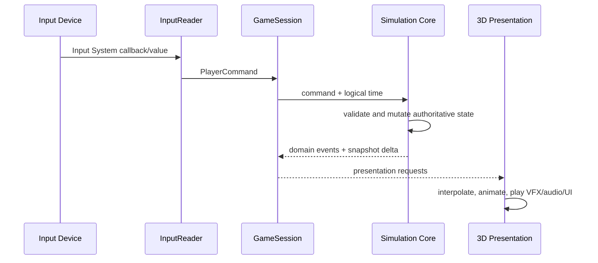

# 런타임 흐름

- 상태: `Accepted` 구조, 세부 tick 수치는 `Proposed`

## 입력에서 표현까지

입력은 장치 이름이 아니라 의미로 변환한다. 초기 명령 집합은 `Move`, `PlaceBomb`, `SwapBomb`, `Pause`다. 키보드·게임패드 키 매핑, 브라우저 focus 복구는 InputReader 바깥의 플랫폼 세부사항이다.

현재 구현된 입력 경계는 다음과 같다.

- Core의 `PlayerCommand`는 장치 타입을 포함하지 않고 명령 종류와 네 방향 이동 의도만 보존한다.
- `BombSwapInputReader`는 게임 전용 `Gameplay` action map을 enable/disable 생명주기에 맞춰 대칭으로 구독한다.
- focus 또는 application pause 상실 시 활성 이동을 `Move(None)`으로 해제하고 action map과 바인딩 장치 상태를 초기화한다.
- `CardinalInputInterpreter`는 아날로그·복합 입력을 결정론적인 단일 상하좌우 방향으로 바꾼다.
- TestSandbox에는 아직 `GameSession`이 없으므로 이 경계는 명령 발행까지만 구현되어 있다.

binding과 세부 전이는 `../Systems/InputAndCommands.md`가 소유한다.

## 논리 처리 순서

한 simulation step에서는 다음 순서를 유지한다. 같은 시각에 일어난 사건의 순서를 고정해 재현성을 확보한다.

1. 수집된 명령을 안정된 순서로 정렬하고 유효성을 검사한다.
2. 이동 의도와 셀 점유 전이를 계산한다.
3. 폭탄 설치·교체 요청과 각각의 쿨타임을 처리한다.
4. 만료된 fuse를 폭발 큐에 넣는다.
5. 폭발 셀을 계산하고 벽 파괴, 폭탄 연쇄 예약, 피해 후보를 수집한다.
6. 같은 step의 피해를 일관된 규칙으로 적용한다.
7. 적 상태 전이와 방 클리어 조건을 평가한다.
8. 도메인 이벤트와 읽기 전용 상태 delta를 내보낸다.

연쇄 폭발은 resolver 안에서 즉시 재귀 호출하지 않는다. `ChainReactionScheduler`에 짧은 고정 지연 사건으로 등록해 폭발 순서와 VFX 가독성을 보장한다.

## 시간

- Core는 `Time.time`, `Time.deltaTime`, Coroutine을 직접 읽지 않는다.
- Unity Runtime이 일시정지 정책을 적용한 논리 시간을 전달한다.
- 폭탄 fuse, 설치 쿨타임, 교체 쿨타임, 피격 무적은 같은 게임 시계 의미를 사용한다.
- 정확한 simulation step 주기와 이동 보간 방식은 첫 수직 슬라이스에서 프로파일링 후 확정한다.
- VFX와 UI 애니메이션 시간은 게임 규칙 시간과 분리할 수 있다.

현재 Core의 최소 시간 계약은 다음과 같다.

- 규칙 소비자는 `IGameClock.Now`의 `TimeSpan`만 읽는다.
- `ManualGameClock`은 0 이상의 초기 시각과 `Advance(TimeSpan)`으로만 전진한다.
- 음수 초기값과 음수 경과 시간은 상태를 변경하지 않고 거부한다.
- 일시정지는 Unity Runtime이 `Advance`를 호출하지 않는 방식으로 표현한다.
- `Advance` 간격은 아직 simulation step 주기를 확정하지 않으며, 테스트와 향후 Runtime 어댑터가 같은 시계를 주입할 수 있게 하는 경계다.

## 랜덤과 재현

- 던전 생성과 콘텐츠 선택은 명시적 run seed를 받는다.
- Core에서 `UnityEngine.Random`을 사용하지 않는다.
- seed, 게임 정의 버전, 필요 최소한의 명령 로그로 실패 상황을 재현할 수 있어야 한다.
- 시각적 파티클 랜덤은 규칙 결과에 영향을 주지 않는 한 재현 대상이 아니다.

## 오류 경계

- 유효하지 않은 명령은 상태를 부분 변경하지 않고 거부 결과를 반환한다.
- 필수 콘텐츠 정의 누락은 시작 시 검증해 플레이 중 null 예외로 미루지 않는다.
- 표현 실패가 Core 상태를 되돌리거나 바꾸지 않는다.
- 브라우저 focus 상실 시 이동/설치 입력을 stuck 상태로 남기지 않고 명령 버퍼를 정리한다.
