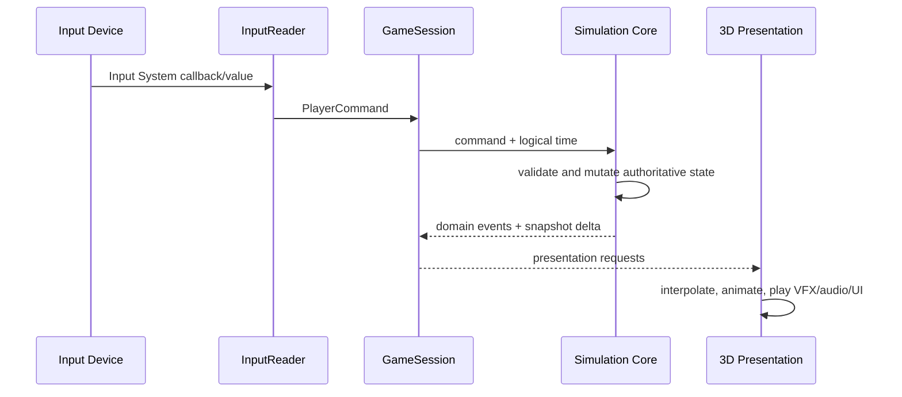

# 런타임 흐름

- 상태: `Accepted` 구조, 세부 tick 수치는 `Proposed`

## 입력에서 표현까지

입력은 장치 이름이 아니라 의미로 변환한다. 현재 명령 집합은 `Move`, `PlaceBomb`, `SwapBomb`, `Interact`, `Pause`, `RestartRun`이다. 키보드·게임패드 키 매핑, 브라우저 focus 복구는 InputReader 바깥의 플랫폼 세부사항이다.

현재 구현된 입력 경계는 다음과 같다.

- 첫 enabled 씬 `DungeonLobby`에는 run host와 gameplay input reader가 없다. 씬에 배치된 TMP Canvas와 Input System UI EventSystem을 `PrototypeLobbyPresenter`의 직렬화 참조로 연결하고, presenter가 `게임 시작` Submit을 받으면 `DungeonStart`를 단일 로드한다. 기존 dungeon bootstrap은 그때 처음 persistent run host를 만든다.
- Core의 `PlayerCommand`는 장치 타입을 포함하지 않고 명령 종류와 네 방향 이동 의도만 보존한다.
- `BombSwapInputReader`는 게임 전용 `Gameplay` action map을 enable/disable 생명주기에 맞춰 대칭으로 구독한다.
- focus 또는 application pause 상실 시 활성 이동을 `Move(None)`으로 해제하고 action map과 바인딩 장치 상태를 초기화한다.
- `CardinalInputInterpreter`는 아날로그·복합 입력을 결정론적인 단일 상하좌우 방향으로 바꾸며, 동일 크기 두 축에 현재 방향이 포함되면 이전 축에 직교하는 새 전환 축을 우선한다.
- `PlayerMovementSimulation`은 주입 시계 경과량 × cells/s로 Core `GridSubcellPosition`을 진행한다. 방향 해제는 다음 10ms step부터 위치를 멈추고, 새 방향은 다음 step의 변위 축에 적용하며 정수 점유는 셀 경계에서만 전이한다.
- TestSandbox의 `PrototypeGameSession`이 하나의 `GridState`와 `ManualGameClock`을 만들고 `PlayerMovementSimulation`, 전투 활성 시 `ChaserEnemySimulation`과 선택적 `ChargerEnemySimulation`·`ArmoredEnemySimulation`, `BombSimulation`, `BombWeaponLoadout`, 플레이어·각 적 체력 simulation에 공유한다. `Move`는 플레이어 이동으로, `PlaceBomb`과 `SwapBomb`은 활성 폭탄 슬롯으로 전달하고, `Interact`는 현재 cardinal 인접 오브젝트 presenter에 알린다. 적 비활성 placeholder는 같은 이동·폭탄·체력을 사용하지만 적 actor를 만들지 않고 처음부터 안전방으로 취급한다.
- `PrototypeCombatRoomDefinitionAsset`이 격자 크기·셀 크기·고정/파괴 가능 벽·플레이어/필수 추격자/선택적 돌진형·갑옷 적 spawn의 저작 권위이며, `TestSandboxContext`는 이 자산에서 런타임 격자를 구성한다. 씬 Transform과 장애물은 같은 셀 데이터를 표현하고 Editor validator가 일치 여부를 확인한다.
- `PrototypePlayerController`는 Core 플레이어 연속 위치를 직접 표시한다. `PrototypeChaserPresenter`, `PrototypeChargerPresenter`, `PrototypeArmoredPresenter`, `PrototypeBombPresenter`, `PrototypePlayerHealthPresenter`는 확정된 적 상태·이동, 정의별 설치·폭발, 피해·사망 결과를 Transform, pooled placeholder, material property block으로 표현한다. `PrototypeBossPresenter`도 Core의 다음 목적지를 Telegraph ghost로 표시하고 확정 `BossMoved` step만 Execute 동안 보간하며 pause 중 멈춘다. 각 presenter는 자신의 규칙을 다시 계산하지 않는다. `PrototypeWeaponHud`는 Core 슬롯 snapshot을 표시하고, `PrototypeHealthHud`는 세션의 확정된 플레이어·보스 체력/phase snapshot을 사건 기반으로 표시한다. 두 HUD 모두 규칙이나 입력을 소유하지 않는다. `PrototypeGameSession`은 실제 pause 상태를 소유하고 입력 재샘플링과 논리 시계 진행 전에 simulation을 차단하며, `PrototypePausePresenter`는 확정 상태를 받아 UI만 표현한다.
- `PrototypeDungeonMinimapPresenter`는 `DungeonRunState.CreateMinimapSnapshot()`의 현재·방문·직접 인접 방과 확인된 연결만 표현한다. 미공개 Secret 방·연결은 제외하고 실제 출구벽 파괴로 해당 연결이 공개되면 binder 사건에서 즉시 다시 그린다. 시작 scene은 초기화 때 한 번, 이후 scene은 `PrototypeDungeonRunHost.RoomCommitted`의 실제 Core commit 뒤 다시 그리며 `Update` polling이나 별도 persistent 지도 상태를 만들지 않는다. X/Z graph 방향을 UI 오른쪽/위쪽으로 그대로 보존한다.
- Core `DungeonRunState`는 `InProgress → Completed | Failed` 단방향 결과를 소유한다. room binder는 `PlayerDied`의 정확한 치명 피해 결과를 `FailureDamage`로 보존하며 실패로, 보스방 `RoomCleared`를 완료로 반영한다. `PrototypeRunCompletionPresenter`는 다음 frame에 결과 snapshot을 읽어 방 세션을 멈추고 `FLOOR CLEARED` 또는 `RUN FAILED`와 source 기반 사망 원인을 표시한다. terminal 상태의 `RestartRun`은 같은 seed와 catalog의 새 session·navigator로 시작 씬을 다시 로드하고, `로비로 돌아가기`는 persistent host를 제거한 뒤 run 없는 `DungeonLobby`를 로드한다.
- 플레이테스트 전용 `PrototypeRoomAdvanceController`는 `RoomCleared`를 한 번 받은 뒤 1.25초 realtime 지연으로 다음 TestSandbox 씬을 단일 로드한다. 중앙 루프→평행 통로→엇갈린 기둥→갑옷 실험 순서이며 마지막 씬은 다음 이름이 비어 있어 머문다. 이 Unity 어댑터는 Core 규칙이나 room asset의 mutable 상태가 아니며, 보상·방 그래프가 생기면 그 흐름으로 대체한다.

binding과 세부 전이는 `../Systems/InputAndCommands.md`가 소유한다.

## 논리 처리 순서

한 simulation step에서는 다음 순서를 유지한다. 같은 시각에 일어난 사건의 순서를 고정해 재현성을 확보한다.

1. 수집된 명령을 안정된 순서로 정렬하고 유효성을 검사한다.
2. 이동 의도와 셀 점유 전이를 계산한다.
3. 폭탄 설치·교체 요청과 각각의 쿨타임을 처리한다.
4. 만료된 fuse를 폭발 큐에 넣는다.
5. 폭발 셀을 계산하고 벽 파괴, 폭탄 연쇄 예약, 피해 후보를 수집한다.
6. 같은 step의 피해를 일관된 규칙으로 적용한다.
7. 적 상태 전이와 방 클리어 조건을 평가한다.
8. 도메인 이벤트와 읽기 전용 상태 delta를 내보낸다.

연쇄 폭발은 resolver 안에서 즉시 재귀 호출하지 않는다. `ChainReactionScheduler`에 짧은 고정 지연 사건으로 등록해 폭발 순서와 VFX 가독성을 보장한다.

파괴 가능 벽은 5단계의 같은 시각 폭발 묶음 계산이 모두 끝난 뒤 Core에서 `Floor`가 된다. 8단계의 `PrototypeDestructibleWallPresenter`는 `DestroyedWalls` 결과만 소비해 시각 블록을 숨기며, 씬 Collider나 GameObject 제거가 규칙을 선행하지 않는다.

## 시간

- Core는 `Time.time`, `Time.deltaTime`, Coroutine을 직접 읽지 않는다.
- Unity Runtime이 일시정지 정책을 적용한 논리 시간을 전달한다.
- 폭탄 fuse, 설치 쿨타임, 교체 쿨타임, 피격 무적은 같은 게임 시계 의미를 사용한다.
- `PrototypeGameSession`은 pause가 적용된 Unity frame 경과 시간을 누적해 플레이어·적·폭탄·피해를 10ms 고정 step으로 함께 진행한다. 플레이어는 각 step의 경과 시간을 연속 거리로 소비한다.
- VFX와 UI 애니메이션 시간은 게임 규칙 시간과 분리할 수 있다.

현재 Core의 최소 시간 계약은 다음과 같다.

- 규칙 소비자는 `IGameClock.Now`의 `TimeSpan`만 읽는다.
- `ManualGameClock`은 0 이상의 초기 시각과 `Advance(TimeSpan)`으로만 전진한다.
- 음수 초기값과 음수 경과 시간은 상태를 변경하지 않고 거부한다.
- 일시정지는 Unity Runtime의 `PrototypeGameSession`이 입력 재샘플링과 `Advance` 전에 `Update`를 반환하는 방식으로 구현한다. `Time.timeScale`을 바꾸지 않으므로 pause UI와 브라우저 생명주기는 게임 규칙 시간과 분리된다.
- Runtime의 관찰 주기는 10ms 고정 step이며 남은 10ms 미만 frame 시간은 다음 `Update`로 이월한다. Core 테스트는 같은 `IGameClock` 경계를 통해 필요한 간격을 직접 주입한다.

현재 승인된 이동 수직 슬라이스는 기본 5 cells/s를 유지하되 별도 한 셀 cadence를 두지 않는다. Runtime이 `Time.deltaTime`을 10ms 단위로 `ManualGameClock`에 전달하면 Core가 이전 관찰 시각 이후의 거리만큼 `GridSubcellPosition`을 진행하고, 셀 경계를 지날 때 정수 점유를 전이한다. 키 해제 중 시간은 다음 입력에 누적하지 않고 Unity 표현은 같은 Core 위치를 직접 표시한다.

폭탄과 슬롯 수직 슬라이스도 같은 시계를 사용한다. `BombSimulation`은 정의의 모양에 따라 cardinal 네 ray인 `CrossExplosionResolver`, 각 셀을 독립 평가하는 `SquareAreaExplosionResolver`, 설치 순간의 바라보기 한 ray인 `ForwardLineExplosionResolver`를 선택하고 결과를 같은 지연 연쇄 스케줄러로 합류시킨다. `PlayerMovementSimulation`은 이동 해제와 분리된 마지막 바라보기 방향을 소유하고 세션이 설치 요청에 전달하며, 활성 폭탄은 이 값을 폭발까지 고정한다. 기본 십자는 fuse 2초·범위 2·설치 1.5초, 3×3 광역은 fuse 1.75초·범위 1·설치 2.5초, 직선은 fuse 2.25초·앞쪽 범위 5(원점 포함 총 6셀)·설치 2.25초, 교체는 2초, 연쇄 지연은 0.15초다. `PrototypeBombDefinitionAsset`, loadout/reward catalog과 세션 설정이 소유하며 플레이테스트 전까지 `Proposed`다.

플레이어 체력 수직 슬라이스는 같은 시계에서 0.75초 무적 종료 시각을 계산한다. 프레임에서는 시계를 먼저 전진하고 이동 전이를 처리한 뒤 만료 폭탄을 계산하며, 폭발 셀에 그 시점의 플레이어 논리 셀이 포함되면 피해를 적용한다. 최대 체력 5, 폭발 피해 1, 접촉 피해 1, 무적 0.75초는 플레이테스트 전까지 `Proposed`다.

기본 추격자도 같은 시계를 사용한다. 한 프레임에서 시계를 전진한 뒤 플레이어 이동, 추격자 이동, 만료 폭탄과 폭발 피해·적 사망, 살아 있는 추격자의 cardinal 인접 접촉 피해 순서로 논리 상태를 확정한다. 같은 프레임 폭발로 죽은 추격자는 점유 제거 뒤 접촉 후보에서 제외되고, 폭발 피해를 먼저 받은 플레이어는 공유 무적으로 뒤의 접촉 피해를 막는다. 표현 사건은 `BombExploded → PlayerDamaged/PlayerDied → EnemyDamaged/EnemyDied → RoomCleared` 순서로 전달한다. 추격자 2 cells/s와 두 칸 방향 유지는 플레이테스트 전까지 `Proposed`다.

돌진형이 있는 세 번째 방의 현재 고정 처리 순서는 `플레이어 이동 → 추격자 이동 → 돌진형 상태/이동 → 만료 폭탄과 플레이어 피해 → 추격자 폭발 피해/사망 → 돌진형 폭발 피해/사망 → 살아 있는 추격자 접촉 피해 → 살아 있는 돌진형 충돌 피해 → 방 클리어`다. 돌진형 충돌은 목표 셀과 겹치지 않고 한 번만 후보를 만들며 기존 플레이어 무적 시간을 공유한다. 적 사망 사건은 `ActorId(2) → ActorId(3)` 고정 순서로 발행한 뒤 살아 있는 적이 없을 때 `RoomCleared`를 한 번 발행한다. 이는 현재 두 적 프로토타입의 결정론적 정책이며 범용 적 scheduler는 아니다.

갑옷 적을 포함하는 공통 고정 처리 순서는 `플레이어 이동 → 추격자 이동 → 선택적 돌진형 상태/이동 → 선택적 갑옷 적 이동 → 만료 폭탄과 플레이어 피해 → ActorId(2→3→4) 폭발 피해/사망 → 같은 ID 순서의 살아 있는 적 접촉·충돌 피해 → 방 클리어`다. 갑옷 적 첫 피격은 방향 유지와 기존 대기를 초기화해 다음 frame의 빠른 cadence를 사용하며, 두 번째 피격만 actor 점유를 제거한다. 네 번째 방에는 돌진형이 없어 추격자→갑옷 적 순서만 활성화된다. 이는 현재 최대 세 적 프로토타입의 결정론적 정책이며 범용 적 scheduler는 아니다.

## 랜덤과 재현

- `DungeonGenerator`는 명시적 `int` run seed와 `DungeonGenerationDefinition`만 받아 normal progression tree를 만든 뒤 결정론적 Secret 후보 후처리를 적용한 `prototype-secret-v3` 논리 그래프를 만든다. 동일 버전·정의·seed의 방 타입, ID, 좌표, 연결 종류는 동일하다.
- 고정 정수 seed 혼합·LCG·곱셈 범위 변환과 유한 후보 배치를 사용하며, 전역 랜덤·시간·호출 순서를 읽지 않는다.
- 생성 결과는 read-only `DungeonGraph`가 소유하고 persistent dungeon run session·navigator가 실제 scene 전환에 사용한다. 독립 TestSandbox 순차 전환은 고정 콘텐츠 플레이테스트용으로만 남아 있다.
- Core `DungeonRunState`가 시작방부터 현재·직전 방, 방문과 클리어 상태를 소유한다. 일반 전투방·보스방은 클리어 전 연결 이동을 막고, 안전방과 이미 클리어한 전투방은 양방향 통과를 허용한다.
- 이동 요청은 연결된 노드 ID 또는 그래프 XZ 좌표에서 해석한 `RoomExitDirection`이며, 씬 이름·Transform·realtime 전환 지연은 Core 계약에 들어가지 않는다.
- `DungeonCombatRoomAssigner`는 같은 run seed에서 고정 salt로 분리한 결정적 흐름을 사용한다. 카탈로그를 안정 room ID로 정렬하고 그래프 연결을 지원하는 회전·정의를 선택하므로 입력 배열 순서나 topology RNG 호출 순서 변화와 결합하지 않는다.
- 방 정의의 cardinal 출구는 잠재 후보이며 배정의 활성 출구 부분집합만 실제 문으로 열어야 한다. Unity 어댑터는 선택된 `RoomRotation`을 Y축 회전에 적용하고 미사용 출구를 닫힌 경계로 표현한다.
- `CombatRoomRotationUtility`는 선택된 회전을 너비·깊이, 플레이어와 모든 적 spawn, 고정·파괴 벽, 안전 셀·퇴로·유도 경로와 출구 셀·방향 전체에 원자적으로 적용한다. Runtime binder는 이 회전 정의와 scene `GridRoot`를 session `Awake` 전에 함께 준비해야 한다.
- `PrototypeDungeonRunSession`은 전역 상태 없이 명시 seed와 검증된 `PrototypeDungeonCombatRoomCatalogAsset`에서 그래프·전투방 배정·탐색 상태를 조합한다. 전투 노드는 Unity room asset·씬 이름으로 조회하고 이동·클리어는 Core 상태에 그대로 위임한다.
- `PrototypeDungeonSpecialRoomCatalogAsset`은 시작방·폭탄 보상방·보스 전실·회복방·비밀방·보스방의 고유 씬 이름을 소유한다. special catalog가 주입된 run session은 모든 그래프 노드를 실제 씬 이름으로 해석하고, combat catalog가 전투방 asset·scene 선택을 계속 소유한다.
- `DungeonRunState`는 현재 방의 북·동·남·서 연결을 `Inactive`·`Locked`·`Open`·`SecretWall`과 대상 방 ID의 read-only snapshot으로 계산한다. 미공개 Secret 연결의 boundary cell은 room binder가 방 로컬 논리 격자에 runtime `DestructibleWall`로 겹쳐 놓고, `BombExplosion.DestroyedWalls`에 해당 셀이 포함된 경우에만 그 연결을 공개한다. Unity 문 표현은 snapshot을 표시할 뿐 공개 여부를 소유하지 않는다.
- `PrototypeDungeonRunNavigator`는 열린 문, 대상 콘텐츠와 씬 로드 가능성을 먼저 확인한 뒤 pending 전환을 만든다. 실제로 기대한 씬 이름이 완료될 때만 Core 이동을 한 번 commit하며, 로드 불가·중복·씬 불일치에서는 현재 방을 바꾸지 않는다.
- `PrototypeDungeonRunHost`는 전용 root GameObject와 run session·navigator만 `DontDestroyOnLoad`로 유지하고 중복 bootstrap 중 primary 한 개만 허용한다. run session은 `DungeonRunState`와 함께 첫 폭탄·보상 후보·선택된 두 번째 폭탄, 현재 체력, Recovery 소비, Secret 연결 공개와 cache 소비를 Core에 보존한다. 각 던전 씬의 room-local binder는 host의 pending 전환, Core 클리어 상태와 run loadout·체력을 session `Awake` 전에 읽어 회전·입장 spawn·방문별 전투 활성 여부·방 로컬 simulation을 준비하고, 문 trigger는 열린 방향만 navigator에 전달한다. 회복방과 비밀방 중앙 셀의 결과는 같은 run 상태로 HUD에 전달되고, room commit 또는 Secret 공개 뒤 미니맵은 같은 `DungeonRunState`에서 제한 정보 snapshot을 새로 만든다. 따라서 클리어 방 재입장의 적 미생성·열린 문, 보상 뒤 loadout persistence, 회복방·비밀방 단일 소비와 지도 공개 범위는 별도 Unity 전역 상태가 아니라 run session에서 파생된다.
- Core에서 `UnityEngine.Random`을 사용하지 않는다.
- seed, 생성 버전, 게임 정의 버전, 필요 최소한의 명령 로그로 실패 상황을 재현할 수 있어야 한다.
- 시각적 파티클 랜덤은 규칙 결과에 영향을 주지 않는 한 재현 대상이 아니다.

## 오류 경계

- 유효하지 않은 명령은 상태를 부분 변경하지 않고 거부 결과를 반환한다.
- 필수 콘텐츠 정의 누락은 시작 시 검증해 플레이 중 null 예외로 미루지 않는다.
- 표현 실패가 Core 상태를 되돌리거나 바꾸지 않는다.
- 브라우저 focus 상실 시 이동/설치 입력을 stuck 상태로 남기지 않고 명령 버퍼를 정리한다.
