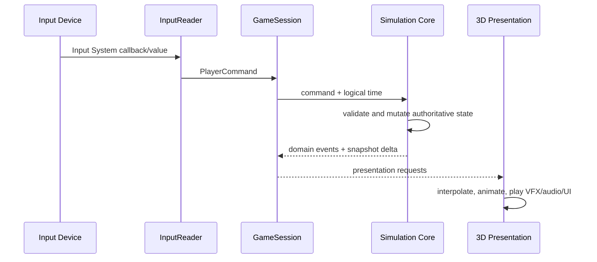

# 런타임 흐름

- 상태: `Accepted` 구조, 세부 tick 수치는 `Proposed`

## 입력에서 표현까지

입력은 장치 이름이 아니라 의미로 변환한다. 초기 명령 집합은 `Move`, `PlaceBomb`, `SwapBomb`, `Pause`다. 키보드·게임패드 키 매핑, 브라우저 focus 복구는 InputReader 바깥의 플랫폼 세부사항이다.

현재 구현된 입력 경계는 다음과 같다.

- Core의 `PlayerCommand`는 장치 타입을 포함하지 않고 명령 종류와 네 방향 이동 의도만 보존한다.
- `BombSwapInputReader`는 게임 전용 `Gameplay` action map을 enable/disable 생명주기에 맞춰 대칭으로 구독한다.
- focus 또는 application pause 상실 시 활성 이동을 `Move(None)`으로 해제하고 action map과 바인딩 장치 상태를 초기화한다.
- `CardinalInputInterpreter`는 아날로그·복합 입력을 결정론적인 단일 상하좌우 방향으로 바꾸며, 동일 크기 두 축에 현재 방향이 포함되면 이전 축에 직교하는 새 전환 축을 우선한다.
- `PlayerMovementSimulation`은 주입 시계 경과량 × cells/s로 Core `GridSubcellPosition`을 매 frame 진행한다. 방향 해제는 위치를 즉시 멈추고, 새 방향은 다음 frame 변위 축에 적용하며 정수 점유는 셀 경계에서만 전이한다.
- TestSandbox의 `PrototypeGameSession`이 하나의 `GridState`와 `ManualGameClock`을 만들고 `PlayerMovementSimulation`, `ChaserEnemySimulation`, `BombSimulation`, `BombWeaponLoadout`, 플레이어·적 체력 simulation에 공유한다. `Move`는 플레이어 이동으로, `PlaceBomb`과 `SwapBomb`은 활성 폭탄 슬롯으로 전달한다.
- `PrototypeCombatRoomDefinitionAsset`이 격자 크기·셀 크기·고정 벽·플레이어/추격자 spawn의 저작 권위이며, `TestSandboxContext`는 이 자산에서 런타임 격자를 구성한다. 씬 Transform과 장애물은 같은 셀 데이터를 표현하고 Editor validator가 일치 여부를 확인한다.
- `PrototypePlayerController`는 Core 플레이어 연속 위치를 직접 표시한다. `PrototypeChaserPresenter`, `PrototypeBombPresenter`, `PrototypePlayerHealthPresenter`는 확정된 적 이동, 정의별 설치·폭발, 피해·사망 결과를 Transform, pooled placeholder, material property block으로 표현한다. `PrototypeWeaponHud`는 Core 슬롯 snapshot을 표시한다. pause 명령의 실제 규칙 소비자는 아직 없다.
- 플레이테스트 전용 `PrototypeRoomAdvanceController`는 `RoomCleared`를 한 번 받은 뒤 1.25초 realtime 지연으로 다음 TestSandbox 씬을 단일 로드한다. 중앙 루프→평행 통로→엇갈린 기둥 순서이며 마지막 씬은 다음 이름이 비어 있어 머문다. 이 Unity 어댑터는 Core 규칙이나 room asset의 mutable 상태가 아니며, 보상·방 그래프가 생기면 그 흐름으로 대체한다.

binding과 세부 전이는 `../Systems/InputAndCommands.md`가 소유한다.

## 논리 처리 순서

한 simulation step에서는 다음 순서를 유지한다. 같은 시각에 일어난 사건의 순서를 고정해 재현성을 확보한다.

1. 수집된 명령을 안정된 순서로 정렬하고 유효성을 검사한다.
2. 이동 의도와 셀 점유 전이를 계산한다.
3. 폭탄 설치·교체 요청과 각각의 쿨타임을 처리한다.
4. 만료된 fuse를 폭발 큐에 넣는다.
5. 폭발 셀을 계산하고 벽 파괴, 폭탄 연쇄 예약, 피해 후보를 수집한다.
6. 같은 step의 피해를 일관된 규칙으로 적용한다.
7. 적 상태 전이와 방 클리어 조건을 평가한다.
8. 도메인 이벤트와 읽기 전용 상태 delta를 내보낸다.

연쇄 폭발은 resolver 안에서 즉시 재귀 호출하지 않는다. `ChainReactionScheduler`에 짧은 고정 지연 사건으로 등록해 폭발 순서와 VFX 가독성을 보장한다.

## 시간

- Core는 `Time.time`, `Time.deltaTime`, Coroutine을 직접 읽지 않는다.
- Unity Runtime이 일시정지 정책을 적용한 논리 시간을 전달한다.
- 폭탄 fuse, 설치 쿨타임, 교체 쿨타임, 피격 무적은 같은 게임 시계 의미를 사용한다.
- 고정 step이 필요한 규칙의 주기는 각 수직 슬라이스가 결정한다. 플레이어 이동은 Unity frame에서 전달된 경과 시간을 연속 거리로 소비한다.
- VFX와 UI 애니메이션 시간은 게임 규칙 시간과 분리할 수 있다.

현재 Core의 최소 시간 계약은 다음과 같다.

- 규칙 소비자는 `IGameClock.Now`의 `TimeSpan`만 읽는다.
- `ManualGameClock`은 0 이상의 초기 시각과 `Advance(TimeSpan)`으로만 전진한다.
- 음수 초기값과 음수 경과 시간은 상태를 변경하지 않고 거부한다.
- 일시정지는 Unity Runtime이 `Advance`를 호출하지 않는 방식으로 표현한다.
- `Advance` 간격은 아직 simulation step 주기를 확정하지 않으며, 테스트와 향후 Runtime 어댑터가 같은 시계를 주입할 수 있게 하는 경계다.

현재 이동 수직 슬라이스는 기본 5 cells/s를 유지하되 별도 한 셀 cadence를 두지 않는다. Runtime이 `Time.deltaTime`을 `ManualGameClock`에 전달하면 Core가 이전 관찰 시각 이후의 거리만큼 `GridSubcellPosition`을 진행하고, 셀 경계를 지날 때 정수 점유를 전이한다. 키 해제 중 시간은 다음 입력에 누적하지 않으며 Unity 표현은 별도 0.2초 보간 없이 같은 Core 위치를 직접 표시한다. 속도와 코너 보정 감각은 후속 플레이테스트 전까지 `Proposed`다.

폭탄과 슬롯 수직 슬라이스도 같은 시계를 사용한다. 기본 십자 폭탄의 현재 저작 값은 fuse 2초·범위 2·설치 1.5초, 빠른 십자 placeholder는 fuse 1.25초·범위 1·설치 0.75초, 교체 2초, 연쇄 지연 0.15초다. `PrototypeBombDefinitionAsset`, `PrototypeBombLoadoutAsset`과 세션 설정이 소유하며 플레이테스트 전까지 `Proposed`다.

플레이어 체력 수직 슬라이스는 같은 시계에서 0.75초 무적 종료 시각을 계산한다. 프레임에서는 시계를 먼저 전진하고 이동 전이를 처리한 뒤 만료 폭탄을 계산하며, 폭발 셀에 그 시점의 플레이어 논리 셀이 포함되면 피해를 적용한다. 최대 체력 5, 폭발 피해 1, 접촉 피해 1, 무적 0.75초는 플레이테스트 전까지 `Proposed`다.

기본 추격자도 같은 시계를 사용한다. 한 프레임에서 시계를 전진한 뒤 플레이어 이동, 추격자 이동, 만료 폭탄과 폭발 피해·적 사망, 살아 있는 추격자의 cardinal 인접 접촉 피해 순서로 논리 상태를 확정한다. 같은 프레임 폭발로 죽은 추격자는 점유 제거 뒤 접촉 후보에서 제외되고, 폭발 피해를 먼저 받은 플레이어는 공유 무적으로 뒤의 접촉 피해를 막는다. 표현 사건은 `BombExploded → PlayerDamaged/PlayerDied → EnemyDamaged/EnemyDied → RoomCleared` 순서로 전달한다. 추격자 2 cells/s와 두 칸 방향 유지는 플레이테스트 전까지 `Proposed`다.

## 랜덤과 재현

- 던전 생성과 콘텐츠 선택은 명시적 run seed를 받는다.
- Core에서 `UnityEngine.Random`을 사용하지 않는다.
- seed, 게임 정의 버전, 필요 최소한의 명령 로그로 실패 상황을 재현할 수 있어야 한다.
- 시각적 파티클 랜덤은 규칙 결과에 영향을 주지 않는 한 재현 대상이 아니다.

## 오류 경계

- 유효하지 않은 명령은 상태를 부분 변경하지 않고 거부 결과를 반환한다.
- 필수 콘텐츠 정의 누락은 시작 시 검증해 플레이 중 null 예외로 미루지 않는다.
- 표현 실패가 Core 상태를 되돌리거나 바꾸지 않는다.
- 브라우저 focus 상실 시 이동/설치 입력을 stuck 상태로 남기지 않고 명령 버퍼를 정리한다.
