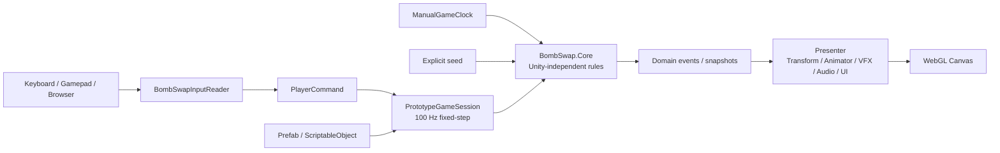

  

<h1 align="center">GooseBomb</h1>

  <strong>놓고, 바꾸고, 유도하고, 터뜨려라!</strong> 
  폭탄이 터질 위치와 시간을 설계하며 던전을 돌파하는 
  3D 탑다운 룸 액션 로그라이트

  <a href="https://lhwsam.github.io/OpenAI-Project/">
    <strong>🎮 브라우저에서 바로 플레이하기</strong>
  </a>

  
  
  
  
  

---

## 게임 소개

**GooseBomb**는 거위가 되어 다양한 폭탄을 설치하고 교체하며 던전을 돌파하는 3D 탑다운 룸 액션 로그라이트입니다.

폭탄마다 폭발 범위와 재사용 대기시간이 다르기 때문에 단순히 적을 향해 공격하는 것만으로는 충분하지 않습니다. 적의 움직임을 예상하고, 몇 초 뒤 폭탄이 터질 공간을 설계하며, 자신이 만든 위험에서 빠져나와야 합니다.

서로 다른 폭탄을 상황에 맞게 교체하고 연쇄 폭발을 만들어 던전의 마지막에 기다리는 보스를 쓰러뜨리는 것이 목표입니다.

  
  

## 핵심 특징

### 상황에 맞게 교체하는 폭탄

일반 폭탄, 범위 폭탄, 직선 폭탄은 서로 다른 폭발 형태와 재사용 대기시간을 가집니다. 두 개의 폭탄 슬롯을 교체하며 방 구조와 적의 위치에 맞는 폭탄을 선택해야 합니다.

### 미래의 공간을 설계하는 전투

폭탄은 설치 즉시 피해를 주지 않습니다. 폭발까지 남은 시간 동안 적을 범위 안으로 유도하고, 다음 폭탄을 배치하며, 안전한 퇴로를 확보해야 합니다.

### 수제 방과 절차적 던전

전투 공간은 직접 설계한 방을 기반으로 구성되며, 매 게임마다 방의 연결과 진행 경로가 달라집니다. 전투방뿐 아니라 보상방, 회복방, 비밀방과 보스방을 탐색할 수 있습니다.

### 서로 다른 행동 패턴의 적

플레이어를 추격하는 적, 빠르게 돌진하는 적, 스스로 폭발하는 적과 폭탄을 던지는 적이 등장합니다. 마지막에는 여러 공격 패턴과 페이즈를 가진 보스가 기다립니다.

### 전투를 전달하는 시각·청각 연출

폭발 예상 범위, 홀로그램 텔레그래프, 폭발 VFX, 카메라 흔들림, 상황별 UI와 사운드를 통해 위험과 공격 타이밍을 직관적으로 전달합니다.

## 조작 방법

| 동작 | 기본 키 |
|---|:---:|
| 이동 | 방향키 |
| 폭탄 설치 | `Z` |
| 폭탄 교체 | `X` |
| 오브젝트 상호작용 | `F` |
| 일시정지 | `Esc` |
| 런 재시작 | `R` |

방향키 대신 `WASD`도 사용할 수 있으며, 설정 화면에서 주요 키를 변경할 수 있습니다.

> WebGL 실행 후 키가 반응하지 않는 경우 게임 화면을 한 번 클릭해 주세요.  
> PC 환경의 Chrome 또는 Edge 브라우저 플레이를 권장합니다.

## 프로젝트 정보

| 항목 | 내용 |
|---|---|
| 게임명 | GooseBomb |
| 장르 | 3D 탑다운 룸 액션 로그라이트 |
| 플랫폼 | PC WebGL |
| 개발 기간 | 약 2주 |
| 개발 인원 | 2명 |
| 엔진 | Unity 6000.5.3f1 |
| 렌더링 | Universal Render Pipeline |
| 주요 기술 | C#, Unity Input System, DOTween, ScriptableObject |

## 프로그래밍 아키텍처

GooseBomb는 Unity 오브젝트의 상태를 곧바로 게임 규칙으로 사용하지 않습니다. 게임 판정을 담당하는 순수 C# Core와 Unity 입력·표현 계층을 분리하고, 두 계층 사이에서는 의미 명령과 확정된 결과만 전달합니다.

### 계층별 책임

| 계층 | 실제 위치 | 책임 |
|---|---|---|
| Core | [`Assets/Game/Core`](Assets/Game/Core) | 논리 격자, 이동, 폭탄, 폭발, 피해, 적 AI, 보스와 던전 규칙 |
| Runtime·Authoring | [`Assets/Game/Runtime`](Assets/Game/Runtime), [`Assets/Game/Authoring`](Assets/Game/Authoring) | Unity 생명주기, 입력 변환, Core 실행, ScriptableObject 데이터 변환과 씬 연결 |
| Presentation | [`Assets/Game/Presentation`](Assets/Game/Presentation) | Transform, Animator, VFX, Audio, UI와 카메라 표현 |
| Editor | [`Assets/Game/Editor`](Assets/Game/Editor) | 콘텐츠 검증, 안전한 에셋 생성·수정, 빌드 자동화 |
| Tests | [`Assets/Game/Tests`](Assets/Game/Tests) | Core 규칙, Unity 연결, 콘텐츠와 플랫폼 회귀 검증 |

`BombSwap.Core`는 `UnityEngine`, Input System과 서드파티 패키지를 참조하지 않습니다. Unity Runtime은 Core를 사용할 수 있지만 Core가 Unity를 역참조하지 않도록 asmdef 의존 방향을 고정했습니다. 자세한 경계는 [기술 아키텍처 문서](Docs/Architecture/Overview.md)에서 확인할 수 있습니다.

### 입력에서 화면까지의 흐름

1. [`BombSwapInputReader`](Assets/Game/Runtime/Input/BombSwapInputReader.cs)가 키보드·게임패드 입력을 장치 정보가 없는 `PlayerCommand`로 변환합니다.
2. [`PrototypeGameSession`](Assets/Game/Runtime/Prototype/PrototypeGameSession.cs)이 Unity 프레임 시간을 누적하고 10ms 간격으로 Core 시뮬레이션을 진행합니다.
3. Core가 이동 가능 여부, 점유 전이, 폭탄 설치, 피해와 상태 전이를 판정합니다.
4. 확정된 도메인 이벤트와 snapshot만 Presenter에 전달합니다.
5. Presenter는 결과를 애니메이션·VFX·사운드·UI로 표현하며 게임 규칙을 다시 계산하지 않습니다.

## 핵심 시스템 설계

### 정수 XZ 논리 격자와 예약 기반 점유

캐릭터의 Transform이나 물리 충돌 순서 대신 [`GridState`](Assets/Game/Core/Grid/GridState.cs)를 공간 판정의 기준으로 사용합니다. Actor는 다음 접근 셀을 먼저 예약하고 셀 경계를 통과할 때 점유를 원자적으로 이전합니다. 방향 전환, 폭탄 설치와 여러 Actor의 동시 접근에서도 중복 점유와 예약 누수를 방지합니다.

플레이어는 4방향 연속 이동을 사용하지만 논리 점유는 경계에서만 바뀌며, 적은 시작한 한 칸을 완료한 뒤 다음 행동을 판단합니다. 두 정책은 [`PlayerMovementSimulation`](Assets/Game/Core/Movement/PlayerMovementSimulation.cs)과 적별 simulation으로 분리되어 같은 격자 안전 규칙을 공유합니다.

### 100Hz 고정 시뮬레이션과 주입 가능한 시간

[`FixedStepAccumulator`](Assets/Game/Core/Time/FixedStepAccumulator.cs)가 가변 프레임 시간을 10ms 단위 simulation step으로 나눕니다. 플레이어 이동 거리는 `elapsed × cellsPerSecond`로 계산하고, 폭탄 fuse·쿨타임·피해 무적·적과 보스 상태도 주입된 논리 시계를 기준으로 진행합니다.

이 구조를 통해 렌더링 프레임 변화와 일시정지가 게임 판정 순서를 바꾸지 않도록 했으며, 테스트에서는 실제 시간을 기다리지 않고 원하는 시각으로 규칙을 재현할 수 있습니다.

### 공용 폭탄·폭발 파이프라인

[`BombSimulation`](Assets/Game/Core/Bombs/BombSimulation.cs)은 플레이어, 투척병, 자폭병과 보스가 만든 폭탄을 같은 흐름으로 처리합니다. 폭탄 형태에 따라 십자, 사각 범위, 전방 직선 resolver를 선택하고 파괴 불가 벽과 파괴 가능 벽의 전파 규칙을 적용합니다.

연쇄 폭발은 resolver 안에서 즉시 재귀 실행하지 않습니다. 영향 셀에 있는 폭탄을 짧은 고정 지연으로 다시 예약해 동일한 scheduler 순서에서 처리하므로 폭탄 종류와 생성 주체가 달라도 일관된 결과를 만듭니다.

### seed 기반 절차 생성과 수제 전투 공간

[`DungeonGenerator`](Assets/Game/Core/Dungeon/DungeonGenerator.cs)는 명시적인 seed와 생성 정의를 입력받아 던전 그래프를 만듭니다. 같은 버전·정의·seed는 같은 결과를 만들기 때문에 버그가 발생한 런을 테스트에서 다시 재현할 수 있습니다.

절차 생성은 방의 연결과 배치를 담당하고, 실제 전투 공간은 직접 제작한 room prefab과 metadata를 사용합니다. 무작위 탐색성과 전투 공간의 공정성을 서로 다른 책임으로 분리했습니다.

### 상태 기반 적 AI와 보스 전투

추격, 돌진, 자폭과 투척 적은 각자 독립된 Core simulation으로 행동 상태와 다음 이동을 결정합니다. 보스는 [`BossBattleSimulation`](Assets/Game/Core/Bosses/BossBattleSimulation.cs)에서 체력 구간, Telegraph, Execute, Recovery와 소환 상태를 관리합니다.

애니메이션과 공격 VFX는 이 상태를 표현할 뿐 판정 시점에는 관여하지 않습니다. 덕분에 연출 속도를 수정해도 실제 피해, 이동과 페이즈 전환 규칙을 독립적으로 검증할 수 있습니다.

### 데이터 기반 콘텐츠와 연결 검증

폭탄, 적, 보스, 방과 오디오 튜닝은 ScriptableObject로 저작하고 런타임 시작 시 검증된 Core 정의로 변환합니다. 진행 중 상태를 에셋에 기록하지 않기 때문에 런 데이터와 저작 데이터가 섞이지 않습니다.

[`PrototypeContentValidator`](Assets/Game/Editor/ContentValidation/PrototypeContentValidator.cs)는 필수 scene·prefab·입력·ScriptableObject 참조와 Build Settings 구성을 검사합니다. 콘텐츠를 추가하거나 교체했을 때 누락된 연결이 플레이 도중 뒤늦게 발견되는 위험을 줄였습니다.

## 코드 탐색 가이드

| 관심 영역 | 대표 구현 | 확인할 수 있는 내용 |
|---|---|---|
| 입력 어댑터 | [`BombSwapInputReader.cs`](Assets/Game/Runtime/Input/BombSwapInputReader.cs) | 장치 입력을 의미 명령으로 변환하고 브라우저 focus 상실을 복구하는 방식 |
| 게임 세션 | [`PrototypeGameSession.cs`](Assets/Game/Runtime/Prototype/PrototypeGameSession.cs) | 고정 step 실행과 Core 시스템 간 처리 순서 |
| 논리 격자 | [`GridState.cs`](Assets/Game/Core/Grid/GridState.cs) | Actor·폭탄·상호작용 오브젝트 점유와 이동 예약 |
| 플레이어 이동 | [`PlayerMovementSimulation.cs`](Assets/Game/Core/Movement/PlayerMovementSimulation.cs) | 4방향 연속 이동과 셀 경계 점유 전이 |
| 폭탄과 연쇄 | [`BombSimulation.cs`](Assets/Game/Core/Bombs/BombSimulation.cs) | fuse, 형태별 폭발 해석과 지연 연쇄 처리 |
| 던전 생성 | [`DungeonGenerator.cs`](Assets/Game/Core/Dungeon/DungeonGenerator.cs) | seed 기반 재현 가능한 room graph 생성 |
| 보스 상태 | [`BossBattleSimulation.cs`](Assets/Game/Core/Bosses/BossBattleSimulation.cs) | 페이즈와 Telegraph·Execute·Recovery 전이 |
| 검증 진입점 | [`Tools/Verify.ps1`](Tools/Verify.ps1) | 정적 검사부터 Unity와 WebGL 검증까지의 단계별 실행 |

## 팀

| 이름 | 담당 |
|---|---|
| **이현우** | 기획 · 프로그래밍 |
| **허한결** | 아트 · 프로그래밍 |

두 명이 약 2주 동안 기획, 아트, 프로그래밍과 플레이테스트를 함께 진행했습니다.

## AI 협업 개발 방식

GooseBomb는 전체 제작 과정의 약 **90%에서 Codex와 GPT를 적극적으로 활용한 AI 협업 프로젝트**입니다. 대부분의 C# 코드는 Codex가 생성했으며, AI를 단순 코드 자동완성이 아니라 분석·설계·구현·검증을 함께 수행하는 개발 에이전트로 활용했습니다.

### 요구사항을 실행 가능한 계약으로 변환

“이동을 자연스럽게 만들어 달라”와 같은 요청을 그대로 구현하지 않고 다음과 같이 관찰 가능한 계약으로 구체화했습니다.

- 키를 놓으면 다음 10ms step부터 정지한다.
- 방향을 바꾸면 현재 셀의 완료를 기다리지 않는다.
- 한 step에서는 X 또는 Z 한 축만 이동한다.
- 셀 경계를 통과할 때만 논리 점유를 이전한다.
- 방향 전환과 정지를 반복해도 예약과 점유가 누수되지 않는다.

이 계약을 시스템 문서와 테스트 기대값으로 남긴 뒤 Codex가 기존 구조를 분석하고, 영향 범위를 제한해 구현하도록 했습니다. 플레이테스트에서 조작감이 좋지 않은 후보는 통과한 코드라도 폐기하고 요구사항부터 다시 조정했습니다.

### Codex·GPT 활용 영역

- 저장소 구조와 기존 변경 이력 분석
- 게임 구조 설계와 시스템 간 책임 분리
- 대부분의 C# 게임플레이 코드 작성 및 리팩터링
- 플레이어 이동, 폭탄, 적 AI와 보스 시스템 구현
- UI, VFX, 애니메이션과 사운드 연결
- 예외와 회귀 원인 추적 및 최소 범위 수정
- EditMode·PlayMode 테스트 작성
- 설계 문서, 시스템 계약과 인수인계 문서 관리
- Git branch 비교, 충돌 검토와 단계별 통합
- WebGL 빌드 점검 및 GitHub Pages 배포
- 일부 이미지 리소스와 게임 배경음악 제작

### Unity MCP를 이용한 검증 루프

Codex와 실행 중인 Unity Editor를 MCP로 연결해 코드 작성 뒤의 검증까지 같은 작업 흐름에서 수행했습니다.

1. 스크립트 수정 후 Unity의 재컴파일 결과를 확인합니다.
2. Console의 오류와 경고를 읽고 원인을 코드·에셋 연결과 대조합니다.
3. EditMode 테스트로 Unity 비의존 Core 규칙을 검증합니다.
4. PlayMode 테스트로 scene·prefab·ScriptableObject와 Presenter 연결을 확인합니다.
5. 실제 Game View를 확인하고 플레이어가 느끼는 조작감과 연출을 사람이 판단합니다.
6. WebGL 빌드 뒤 브라우저 입력, 오디오, 로딩과 화면 표시를 다시 확인합니다.

### 사람이 직접 결정한 영역

AI가 구현과 검증을 보조했지만 다음 항목은 개발자가 직접 판단하고 결정했습니다.

- 게임의 핵심 콘셉트와 플레이 방향
- 폭탄 교체 시스템과 전투 규칙
- 이동 조작감과 전투 밸런스
- UI 구성과 아트 디렉션
- 애니메이션, VFX와 카메라 연출
- AI 제안의 채택·수정·폐기 여부
- 플레이테스트 결과에 따른 우선순위
- 최종 콘텐츠 선택과 출시 범위

핵심 AI 활용 역량은 코드를 생성하는 것에 그치지 않고, 프로젝트 규칙과 테스트로 AI의 변경 범위를 통제하고 실제 플레이 결과를 바탕으로 반복 개선한 과정에 있습니다.

## 테스트 및 품질 관리

저장소의 공통 검증 진입점인 [`Tools/Verify.ps1`](Tools/Verify.ps1)은 변경 위험에 따라 검증 범위를 단계적으로 확장하도록 구성했습니다.

| 단계 | 검증 대상 |
|---|---|
| Static | asmdef 의존 방향, 금지 API, 문서와 필수 파일 구조 |
| Fast | Core 컴파일과 EditMode 규칙 테스트 |
| Full | Unity 컴파일, EditMode·PlayMode 테스트와 콘텐츠 검증 |
| Web | WebGL 빌드, 로컬 서버와 실제 브라우저 스모크 테스트 |

주요 회귀 검증은 다음을 포함합니다.

- 벽 종류에 따른 폭발 전파와 모든 폭탄의 지연 연쇄
- 이동 중 셀 예약·원자적 점유 전이와 폭탄 설치 직후 탈출
- 두 폭탄 슬롯의 독립 쿨타임과 교체 상태
- 플레이어 피해, 무적 시간과 방 이동 간 체력 유지
- 적 AI와 보스 페이즈의 상태 전이
- 같은 seed의 던전 재현성과 방 연결
- UI·VFX·Audio와 Core 사건의 Unity 연결
- WebGL focus 상실, 키보드·게임패드 입력과 오디오 시작

자동 테스트는 규칙의 정확성과 회귀를 확인하지만 게임의 재미를 대신 판정하지 않습니다. 최종 조작감, 위험 범위의 가독성과 연출 속도는 실제 플레이테스트로 결정했습니다. 자세한 검증 범위는 [테스트 매트릭스](Docs/Testing/TestMatrix.md)에서 확인할 수 있습니다.

## 설계 문서

- [문서 인덱스](Docs/INDEX.md)
- [게임 기획서](Docs/GameDesign/GDD_v0.2.md)
- [기술 아키텍처](Docs/Architecture/Overview.md)
- [런타임 데이터 흐름](Docs/Architecture/RuntimeFlow.md)
- [격자와 이동 시스템](Docs/Systems/GridAndMovement.md)
- [폭탄과 폭발 시스템](Docs/Systems/BombAndExplosion.md)
- [던전 생성 시스템](Docs/Systems/DungeonGeneration.md)
- [보스 전투 시스템](Docs/Systems/BossBattle.md)
- [테스트 매트릭스](Docs/Testing/TestMatrix.md)

## 사용 리소스

프로젝트에는 팀이 직접 제작한 리소스, 생성형 AI로 제작한 이미지와 음악, CC0 리소스 및 외부 Unity 패키지가 함께 사용되었습니다.

외부 리소스는 각 원본의 이용 조건에 따라 관리했으며, 생성형 AI를 활용한 콘텐츠는 위의 AI 활용 항목에 공개했습니다.

---

  <strong>Team VIGILANTE</strong> 
  Made in 2 weeks with Unity and Codex

